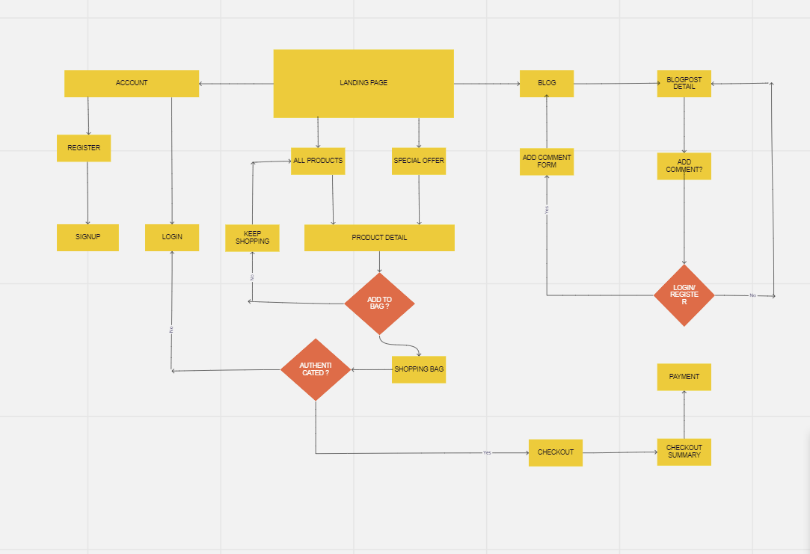
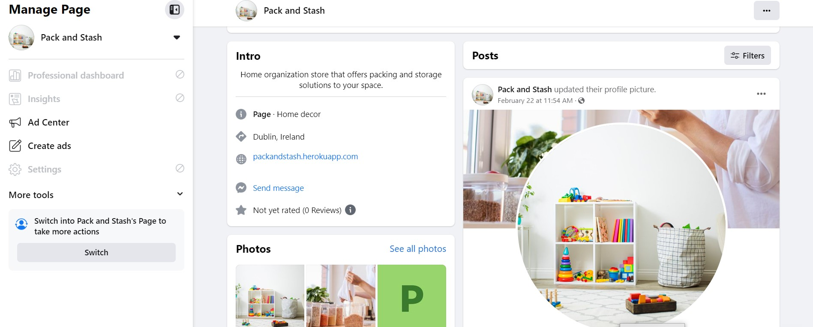

# PACK AND STASH
## Introduction

Pack and Stash is a fictional B2C e-commerce store that is  designed and implemented with Python and Django, HTML, CSS and some Javascript. It specialises in selling home organization products to consumers online. However it has to be noted that this site is for educational use only.

Link to deployed site can be found [Here](https://packandstash.herokuapp.com/)

## Showcase

# UX
## User stories
## As Admin
* As a admin I can manage users' accounts so that I can make any required changes to them if needed
* As a admin I can manage products so that I can add , update or delete products when necessary
* As a admin I can view created orders so that I can full fill the orders or amend if needed
* As a Admin I can delete any of comments so that I can remove them if I nolonger feel they are still necessary or needed
* As a Admin I can view messages sent via contact form so that I can act upon them
* As an admin I can manage the blog content so that I can make amendments if needed

## As a site user
* As a site user I can create or edit my account so that I can update my details accordingly
* As a site user I can login in my account so that I can view my order history
* As a site user I can search for products so that I can find specific products
* As a site user I can sort products on criteria such as price and category so that I can I have a method of ordering the 
products as I prefer
* As a site user I can browse through products so that I can decide what I may be interested in buying
* As a site user I can look at product details so that I can decide if I want to purchase it
* As a site user I can easily add products I want to purchase to a basket so that I can decide whether to purchase or not
* As a site user I can view the contents of my shopping basket so that I can be able to make any adjustments
* As a site user I can update my bag by adding more or remove products so that I can decide on the number of products I intend to buy
* As a site user I can view my order summary so that I can verify it before confirming
* As a site user I can checkout securely so that I can I maintain the level of trust on the site
* As a site user I can view paginated posts so that I can select which posts to view
* As a site user I can view all posts so that I can decide what I may be interested in reading
* As a site user I can comment to the blog posts so that I can express my opinion to the post
* As a site user I can use the contact form so that I can contact the site owners
* As a site user I can sign up to newsletter so that I can keep updated on the latest news

### Strategy
* Pack and Stash is a B2C type of business. Due to pressure of life amongst us from work/business to family not talking of pandemics, many of us are now opting for online shopping. Pack and Stash aims to offer flexible online shopping to its customers.

## Architecture

## Database

  
Click here to view Database Schema:

  

## Design
Before I wrote any code for this site, I had to pin point a simple design of what I wanted my site to look like by using wireframes, not only for myself but as well of communicating what I wanted to archieve to my mentor.

  
Click here to view Wireframes:

  
  
  
  
  
  
  
 
  

## Navigation
I went on to create a flowchart to help me visualise website structure.

  
Click here to view the navigation:

  

## E-commerce type

Pack and stash just to emphasisenis an online store that sells directly to customers. The functionality on this site for a regular customer is ability to make a purchase swiflty and quickly. For the owners, the goal is to archieve CRUD functionality.
## Marketing
Though there are a lot of marketing techniques for businesses, Pack and Stash decided to first use the cheaper way, that is facebook to drive out content and engage with customers. Visit our facebook page [here](https://www.facebook.com/profile.php?id=100090536471512). 

# Features
## Homepage
To start off, clicking the pack and stash url takes you to the home page with a logo on the left, my account and shopping bag to the right, a search bar followed by a navigation menu and footer. All these appear on every page on the site. Also found on home page is  a hero image accompanied by a hero text, and a shop now button beneath it.
### Header and navigation

### The home page

### Register/Sign up
On the right side of the home page, for the first time user they will need to register their account to enjoy most of the site benefits such as saving their orders, commenting on blogs. When registering users are asked their username, email and password

### Sign in
Registered users would need to sign in when they visit the site again. They will be asked to enter their username and password. The Remember me option is also available making life easier for returning users. Is users need to reset their password, a forgot password is also available.

### Logout
Users are able to protecting their account by logging out of the site.

## All products

The first navigation link from the logo is all products. This is where you can display all products available. On this a user has a liberty to sort the products either by price or by category.

 ### Sort by price

 

 ### Sort by category
 

 ### Product detail and add to bag
 Each product on site has a detailed information in form of a name, price,image, description and its category. The user is displayed with a quantity input box to select the quantity they need to add to the shopping bag either increasing or decreasing. They have an option to go back to products by clicking the keep shopping button.  Each time a user add a product to the bag they get a notification that alert them of that action.

 

 

 ### The shopping bag
 Consists of the price, quantity of each item and sub total. User has an option to update their bag and or remove some items from bag. They can easily go back to products by clicking keep shopping or go to checkout.

### Checkout
On the left side of the checkout is where user puts their information, and on the right side is a summary of their order that is the total, the delivery.

User has an option to save their information to a profile. Users will need to input the card number for payment. They still have an option to adjust the bag at this point by clicking the adjust bag, or then completing the order.

### Checkout success
After completing an order, users receive an order confirmation with their details including order number.

### Order confirmation email

### Product detail- super user

If the user is the super user, they have an option to either delete or edit their product

### Product management- add product

Only super users are authorized to add products to products catalogue

### Product management- edit product

Super users only can edit the product by editing either name, description, category, SKU, price and update image. An alert is also available to remind them what action they are performing. They can then update the changes or cancel.

### Product management- delete product

Super users only can as well delete the products from the site

## Special offers

The site has special offers shoppers can take advantage of. From new arrivals to sale.
### New Arrivals

### Sale

# Footer

The footer appears on all pages of the site, it contains the newsletter sign up, about us, privacy policy, facebook and instagram

## Newsletter

Users can sign up using their email to receive news, offers and deals straight into their inbox.

## About us

About us page describes in bried what the site is all about to the users. With a shop now now beneath that takes users to the products page

## Privacy policy

## Facebook

In terms of marketing, the site has a facebook page to push content.

and target some of its customers through content creation

# Blog

Users can view all the blog articles and select which one to read by clicking the image

## Blog detail

Only logged in users are permitted to comment on articles in as much as they can read other comments written by other users

After logging in they can leave a comment on any blog article

# Blog management
## Add blog

Super users are the creators of the blog articles. To add a new blog they have to put title, slug, body and image and then save

## Edit blog

Super users can also edit the blog and update the changes

## Delete post

If the post is no longer serving its purposes, super users can also delete it

## Delete comment

Super users have the ability to delete comments that seem inappropriate

# Contact us

A contact us page is available for users who need to get in touch with the store owners. They have to put their name, email, the topic and the overall message before sending.

# My Profile

The my profile page displays a user's saved contact infomation and their order history

# 404 page

A 404 page is also available to handle navigation errors with a home link button to take them back to the home page

### Future features

* Product rating
* Users replying to other blog comments
* Blog likes

# Web marketing
## Email marketing

The free version of mailchimp was chosen with the current status of the business. Each user that signs up is added to the weekly newsletter and they might turn out to be future customers henceforth low cost to drive sales.

## Search engine optimization

SEO keywords

## Social media marketing

A facebook page was created to build community from the target market. Facebook is free and it also takes little to no time to set up and also it has so many users whom a business can strive to maintain a certain relationship, create content and connect with a target audience.

## Technologies
### Languages

* [HTML](https://developer.mozilla.org/en-US/docs/Web/HTML)

* [CSS](https://developer.mozilla.org/en-US/docs/Web/CSS)

* [Javascript](https://www.javascript.com/)

* [Python](https://www.python.org/)

### Frameworks, programs and libraries used

* [Django](https://www.djangoproject.com/) - Django is a high-level Python web framework that encourages rapid development and clean, pragmatic design.

* [Bootstrap4](https://getbootstrap.com/) - A css framework

* [Gitpod](https://www.gitpod.io/) - Gitpod was used as an IDE

* [Github](https://github.com/) - I used Github to store all the data of my project after pushing it

* [Heroku](https://www.heroku.com/) - is a cloud platform service  I used to deploy and host the project

* [ElephantSQL](https://www.elephantsql.com/) - used as a database for the project

* [Font Awesome](https://fontawesome.com/) - Was used to add icons for my social media links.

* [PEP8ci](https://pep8ci.herokuapp.com/) - I used it to validate python code

* [Balsamiq](https://balsamiq.com/) - was used to draw wireframes

* [dbdiagram](https://dbdiagram.io/home) - was used to draw the database schema

* [Stripe](https://stripe.com/en-ie) - was used for checkout functionality and facilitate online payments

* [AWS](https://aws.amazon.com/s3/) - for  object storage through a web service interface.

* [Unsplash](https://unsplash.com/) - images used for the project

* [Pexels](https://www.pexels.com/) - images used for the project

* [Adobestock](https://stock.adobe.com/ie/) - images used for the project

# Testing

 

  
Click here for Lighthouse results

 Desktop

  

Mobile

  
 
  
 

  

  
Click here for Markup results

   

  
 

  

  
Click here for CSS results 

  

  
 

## Wave

I also tested this site on [WAVE Web Accessibility Evaluation Tool](https://wave.webaim.org/) is a set of evaluation tools which helps authors to make their web content more accessible to individuals with disabilities. WAVE can identify many accessibility and Web Content Accessibility Guideline (WCAG) errors, but also facilitates human evaluation of web content as per definition on their site.

  
Home

  

  I went on to fix the error by adding the aria label to the seach box input

 

Bag

 

About us

Fixed the alerts by adding an h2 level heading to shop now button

 

Privacy policy

 

  
Contact us

  

  changed the level heading. Skipped the labels part as I had no intention to use labels on this page

 

  
Blog detail

I had no intention to add a heading on this page as well as adding headings to blog articles. Changed all comments tag to a paragraph

 

  
Blog

I added the first level heading as i realized it was necessary to keep the site uniform throughout

 

  

All specials

  I added heading to price from paragraph tag. Skipped the labels part as I had no intention to use one

  

Products

Fixed the alerts by adding specified headings both to newsletter and product price

 

  

Product detail

I only have 2 colors black and white throughout the site except the footer border that has the same color with the contrast errror so I decided to skip

 

  

Sign in

 

### Javascript validation
I used JSlint to validate javascript found in some apps

* bag app - semi colon warning

* blog app -  semi colon warnings

* base.html - zero warnings

* newsletter - 8 warnings but the code is directly from mailchimp

* checkout - semi colon warnings

* products - semi colon warnings

* profiles - no warnings

# Manual Testing
 | Feature | Test  | Expected Result | Actual Result |
| -------------| ----- | ----- | :----: |
| PACK AND STASH  | Selecting logo on homepage |  directs user back to homepage |  Pass |
| Search | Using the search box | Entering a search returns expected result  |  Pass |
| Search no results | No search | Entering a no results search returns error message and shows all products  |  Pass |
| Navigation Links  | Selecting navigation links |  directs user to relevant pages |  Pass |
| All products  | Selecting all products |  directs user to all products |  Pass |
| Back to top | Back to top arrow | Select the arrow box on the products page brings the user back to the top of the page  |  Pass |
| Sort By  | Selecting the filter Sort |  successfully sort by price, name and category options |  Pass |
| Shop Now button  | Selecting Shop Now button |  directs user to all  products page |  Pass |
| About Us | Selecting About Us |  directs user to About Us page |  Pass |
| Sign up for our newsletter | selecting Sign up for our newsletter |  directs user Sign up for our newsletter page |  Pass |
| Privacy policy | Selecting privacy policy |  directs user to privacy policy|  Pass |
| facebook icon | Selecting  facebook icon |  directs user to facebook page |  Pass |
| Special offers | Selecting all specials |  directs user to all special offers |  Pass |
| Blog | Selecting blog |  directs user to blog page |  Pass |
| Blog detail | Selecting Blog detail |  directs user to blog detail |  Pass |
| Leave a Comment when signed in | Submitting comment|  successfully submit and display comment |  Pass |
| Add blog | Adding a new blog | successfully add new blog to blog page  |  Pass |
| As Admin edit blog | editing blog|  successfully edited the blog |  Pass |
| As Admin Delete Comment | Deleting comment|  successfully remove comment |  Pass |
| Contact | Selecting Contact | directs user to contact page  |  Pass |
| Contact form submission | submitting contact form | successfully sends submit form and can seen be in admin |  Pass |
| My account | Selecting my account as admin | displays dropdown menu unique to admin apart from profile and logout  |  Pass |
| Add product | Adding a new product| successfully add new product to products page  |  Pass |
| Add Product | no image is selected | default image is used |  Pass |
| As Admin edit product | editing product |  successfully edited the product |  Pass |
| As Admin Delete product | Deleting product|  successfully remove product |  Pass |
| Register | Register for an account | selecting Register in my account directs user signup page |  Pass |
| Register | Registering as a new user | Registering as a new user form works |  Pass |
| Login | Login to an account | selecting Login in my account directs user to Login page |  Pass |
| Login | Login to an account | login-in as a new user form works |  Pass |
| Login as admin| Login to as admin gives access to blog/product management | login-in as a new user form works |  Pass |
| Logout | message shown | Logging out message shown |  Pass |

## Bugs
For this project there were so many bugs I encountered from the beginning though some were minor. Some of them I ended up taking them to tutor support whom have been very helpful

1. Toasts not showing/displaying - Having all the code set up properly and checking in chrome dev tools I could see they were rendering in my template however not displaying. To fix this (from tutor support), There is a script in base.html to show any toasts in postloadjs and in the template I wanted them to show up I had a  without {{ block.super }} in it. This resulted in the block from base.html being overwritten by a blank block. Removing the blank block in the detail template fixed it

2.  In testing my search box and product management - error handling was not working each time I was testing the search box and product management. The fix was simple though it took me hours, I searched via Code Institute slack and found out someone made my mistake as well of missing out a closing div tag in toast error.

 

 
 
3. I had errors in validating html and to resolve them I had to put ul tags in mobile header which led to the bug below. To fix this I added padding to icons(search, my account, bag)

4. Double orders in admin panel

Solution: In checkout views.py in the checkout function, 2 following lines of code fixed it
 

## Unfixed bug

When searching for an item that isnt available, correct result is displayed however I couldnt place the footer where it belongs on that page. I tried to use the     height: calc(vh - px), realized I was having another bug with the sort box after wards. However its something that I will later on have to fix.

# Deployment

I developed this site on Gitpod, using git for version control. Then deployed to Heroku using the following steps

* Log in to [Heroku](https://id.heroku.com/login) or create an account

* Click New and Create New App

* I selected Europe as region.

* Click Create App button

I then went to create a database to connect to the new created app.

* Login to [ElephantSQL](https://www.elephantsql.com/)

* Create new instance

* Set up your plan - Give the plan a name and select Tiny Turtle free plan

* Select region button

* Select a data center ner your. I selected EU-West-1(Ireland)

* Click Review

* Click Create instance

* Return to elephantsql dashboard, click on database instance name

* In the url section, clicking the copy icon will copy the database url to the clipboard

* Go back to Heroku to your created app, go to Settings

* Add config var DATABASE-URL, and for the value, copy in your databse url from ElephantSQL. do not add quotation marks around your database

* In Gitpod install dj-database_url and psycopg2 to connect to your external database

* Update requirements.txt: pip freeze > requirements

* import dj_database_url in settings and update your database

* migrate your database

* create a new superuser for your database and at this point your database is exposed do not commit it to github

* Install gunicorn and freeze into the requirements file

* Then create Procfile

* DISABLE_COLLECTSTATIC

* Commit and push to github

* On your app in Heroku go to Deploy and connect it to github and search your repository, click connect.

* Choose automatic or manual deploy. I chose manual. Click deploy branch

* When complete click View to open the deployed app

# From Github docs

### Forking 

* Open GitHub page that hosts the repository you wish to fork.
* Find the 'Fork' button at the top right of the page
* Once you click the button the fork will be in your repository

### Cloning
* Open Go to the repository page on Github
* click on the green button that says "Code".
* You can choose to download a zip file of the repository, unpack it on your local machine, and open it in your IDE.
* Copy the URL under the HTTPS tab to clone using https.
* In a new window, and set the current directory to the one you want to contain the clone from.
* Type git clone and paste the URL copied from the GitHub page.
* The repository clone will now be created on your machine. 

## Credits
* Images are from [Unsplash](https://unsplash.com/s/photos/home-organization), [Adobestock](https://stock.adobe.com/ie/), [Pexels](https://www.pexels.com/)

* Code Institute Botique Ado walk through

* Hello django code institute

* [Dataflair django tutorial](https://data-flair.training/blogs/django-tutorials-home/)

* [Stack overflow](https://stackoverflow.com/)

Products description inspiration from

* [The neat system](https://www.theneatsystem.co.za/)
* [Amazon](https://www.amazon.co.uk/)
* [Ikea](https://www.ikea.com)

#### Blog content

* [Home edit](https://thehomeedit.com/)
* [Prettty organized home](https://www.organisedprettyhome.com/organise-kids-toys)
* [Woman's day](https://www.womansday.com/)
* [The neat method](https://neatmethod.com/)

### Acknowledgement and support

* This whole chapter took me a year and 5 months to complete instead of a year due to circumstances beyond control. Despite all this I would love to extend my gratitude to Code institute and their amazing team.  The tutor support for this project in particular, Ed, Ger you guys did a superb job.

* My Mentor Adegbenga Adeye sharp,straight and honest feedback

* My very own lovely husband who funded this course

                  

  

 

 

